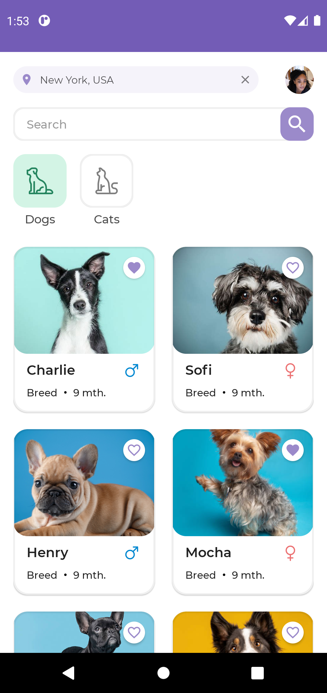
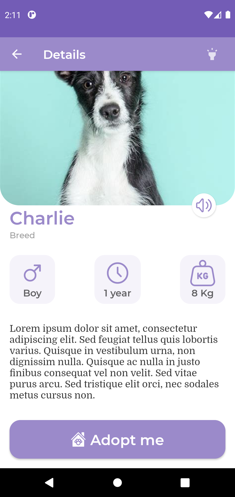
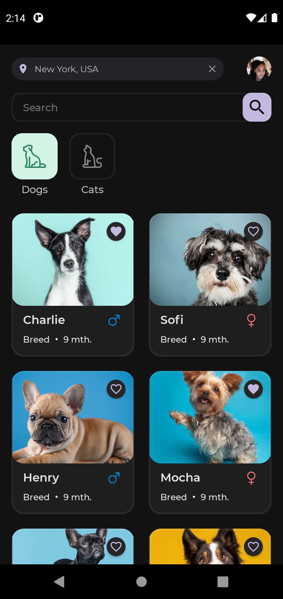
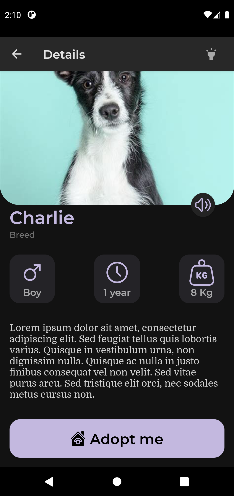

# Petoption


## :scroll: Description

Petoption is a modern pet adoption app that will help you find your special pet in no time.


## :bulb: Motivation and Context

The most interesting part of my submission is the fact that I was able to build a beautiful modern app from scratch and still have fun doing it. I'm so proud of Jetpack Compose and the Jetpack Compose team, they've really come a long way. looking forward to the stable release :smile:.


## :camera_flash: Screenshots





## License

```
Copyright 2020 The Android Open Source Project

Licensed under the Apache License, Version 2.0 (the "License");
you may not use this file except in compliance with the License.
You may obtain a copy of the License at

    https://www.apache.org/licenses/LICENSE-2.0

Unless required by applicable law or agreed to in writing, software
distributed under the License is distributed on an "AS IS" BASIS,
WITHOUT WARRANTIES OR CONDITIONS OF ANY KIND, either express or implied.
See the License for the specific language governing permissions and
limitations under the License.
```